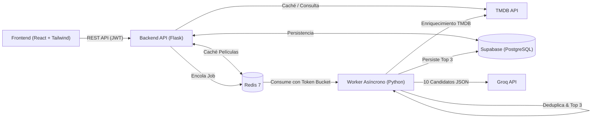

# Sistema de Recomendación de Películas con LLMs (Instant)

Solución integral y modular para la prueba técnica de **Instant (Junior Software Developer)**.  
Combina el catálogo de películas de **The Movie Database (TMDB)** con un motor de recomendación inteligente impulsado por **Groq Cloud API** (`llama-3.3-70b-versatile`), desacoplado mediante una cola de eventos en **Redis** con algoritmo de **Rate Limiting (Token Bucket)** en un worker de Python.

---

## Características Principales

*  **Autenticación & Usuarios:** Registro e inicio de sesión con JWT y contraseñas hasheadas (`bcrypt`).
*  **Catálogo TMDB:** Explorador de películas populares y búsqueda por título con paginación y caché en Redis.
*  **Gestión de Favoritos (Me Gusta):** Marcado y desmarcado de películas favoritas persistidas en **Supabase (PostgreSQL)**, permitiendo además convertir recomendaciones directamente a favoritos.
*  **Recomendaciones con IA (Groq):** Inferencia con respuestas estructuradas en JSON. Solicita 10 candidatos al LLM, deduplica contra favoritos y recomendaciones previas, y entrega el **Top 3 de películas recomendadas** justificadas.
*  **Worker Asíncrono con Rate Limiting:** Encolamiento en Redis y limitador de tasa *Token Bucket* para respetar los límites de cuota (RPM/TPM) de Groq con reintentos y *Exponential Backoff*.
*  **Frontend Moderno:** Single Page Application (SPA) en React + Vite + Tailwind CSS con polling reactivo de trabajos en segundo plano y gestión de historial.
*  **100% Dockerizado:** Despliegue de todo el stack en un solo comando con `docker compose up --build`.

---

## Arquitectura de la Solución



Para una explicación exhaustiva de las decisiones y diagramas detallados, consulta [docs/ARCHITECTURE.md](docs/ARCHITECTURE.md).

---

## Puesta en Marcha Rápida (Docker Compose)

### 1. Clonar el repositorio y configurar variables de entorno
```bash
git clone <URL_DEL_REPOSITORIO>
cd Prueba-Instant

# Crear archivo .env a partir de la plantilla
cp .env.example .env
```

Edita el archivo `.env` completando tus credenciales de **Supabase**, **TMDB** y **Groq**:
```env
SUPABASE_URL=https://tu-proyecto.supabase.co
SUPABASE_KEY=tu_clave_anon_o_service_role
TMDB_API_KEY=tu_api_key_de_tmdb
GROQ_API_KEY=tu_api_key_de_groq
```

### 2. Configurar la Base de Datos en Supabase
Ejecuta el script SQL ubicado en [docs/schema.sql](docs/schema.sql) dentro del **SQL Editor** de tu panel de Supabase para crear las tablas e índices relacionales (`users`, `movies`, `user_likes`, `recommendations`).

### 3. Levantar los contenedores
```bash
docker compose up --build
```

Una vez levantado:
* **Frontend:** `http://localhost:3000`
* **Backend API:** `http://localhost:5000/api`
* **Healthcheck:** `http://localhost:5000/api/health`

---

## Ejecución en Desarrollo Local (Sin Docker)

### Backend
```bash
cd backend
python -m venv venv

# Windows:
.\venv\Scripts\activate
# Linux/macOS:
source venv/bin/activate

pip install -r requirements.txt

# Iniciar servidor API
python run.py

# En otra terminal, iniciar el Worker Asíncrono
python worker.py
```

### Frontend
```bash
cd frontend
npm install
npm run dev
```

---

## Documentación de Referencia

* **[Arquitectura y Decisiones de Diseño (ARCHITECTURE.md)](docs/ARCHITECTURE.md)**
* **[Especificación de Endpoints (ENDPOINTS.md)](docs/ENDPOINTS.md)**
* **[Esquema de Base de Datos SQL (schema.sql)](docs/schema.sql)**
* **[Directrices para Agentes de IA (AGENTS.md)](AGENTS.md)**
