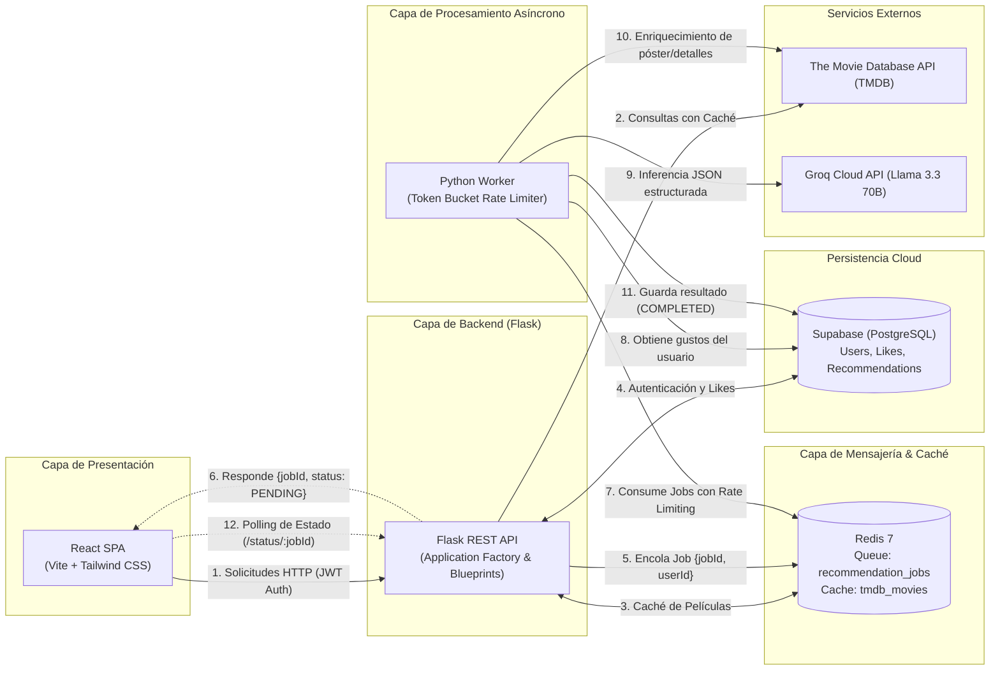

# Documento de Arquitectura y Decisiones Técnicas

**Proyecto:** Sistema de Recomendación de Películas con LLMs y Worker Asíncrono  
**Empresa:** Instant (Prueba Técnica)  
**Autor:** Candidato Junior Software Developer  

---

## 1. Visión General de la Arquitectura

El sistema está diseñado bajo el paradigma de **Arquitectura Desacoplada y Orientada a Eventos / Tareas Asíncronas**. Resuelve el desafío de procesar solicitudes de recomendación generadas por Modelos de Lenguaje de Gran Escala (LLMs) sin bloquear el hilo principal de la API HTTP y garantizando el cumplimiento de las tasas límite (*Rate Limits*) impuestas por los proveedores de inferencia.

### Diagrama de Flujo y Componentes



---

## 2. Justificación de Decisiones Tecnológicas

### 2.1. Backend: Python 3.11+ con Flask
* **¿Por qué Python?** Es el lenguaje de referencia en el ecosistema de Inteligencia Artificial y LLMs, contando con SDKs oficiales optimizados (como el de `groq`) y excelentes herramientas para manejo de datos (`pydantic`).
* **¿Por qué Flask?**
  * Proporciona la flexibilidad necesaria para implementar una arquitectura limpia (*Clean Architecture*) sin el sobrepeso de frameworks monolíticos.
  * Permite estructurar la solución usando el patrón **Application Factory** y **Blueprints**, logrando una clara separación de responsabilidades por módulos (`auth`, `movies`, `likes`, `recommendations`).
  * Fácil de contenerizar y de arrancar en milisegundos dentro de Docker.

### 2.2. Base de Datos: Supabase (PostgreSQL)
* **¿Por qué Supabase?**
  * Ofrece la potencia de un motor relacional estándar de la industria (PostgreSQL) en la nube, con soporte nativo para claves foráneas, restricciones de unicidad, tipos JSONB e índices optimizados.
  * Facilita la persistencia confiable de las relaciones `User -> UserLikes -> Movies` y el almacenamiento del historial de recomendaciones `Recommendations`.

### 2.3. Message Broker & Caché: Redis
* **¿Por qué Redis?**
  * Almacenamiento en memoria ultra-rápido (latencias < 1ms).
  * Actúa como broker de la cola de eventos `recommendation_jobs`, permitiendo que el endpoint `POST /api/recommendations/request` responda instantáneamente en lugar de dejar la conexión HTTP colgada esperando la inferencia.
  * Sirve como capa de caché para las respuestas de la API de TMDB, reduciendo la latencia para los usuarios y evitando el consumo innecesario de cuota externa.

### 2.4. Motor de Inferencia: Groq Cloud API (`llama-3.3-70b-versatile`)
* **¿Por qué Groq?**
  * La arquitectura LPU (Language Processing Unit) de Groq ofrece velocidades de inferencia líderes en la industria (~500+ tokens por segundo).
  * Soporte nativo de *Structured Outputs* (`response_format={"type": "json_object"}`), garantizando que las respuestas del LLM siempre sigan el esquema JSON requerido sin alucinaciones sintácticas.

### 2.5. Frontend: React + Vite + Tailwind CSS
* **¿Por qué este stack en el Frontend?**
  * **100% Portabilidad UNIX:** Se ejecuta de forma idéntica en Linux, macOS o dentro de contenedores Docker.
  * **Vite:** Arranque y compilación instantáneos con HMR (*Hot Module Replacement*).
  * **Tailwind CSS:** Diseño moderno, responsivo y modo oscuro con mínimo peso en producción.
  * **TanStack Query / Polling Reactivo:** Gestión elegante del estado asíncrono para consultar el progreso de las recomendaciones.

---

## 3. Patrón de Rate Limiting y Resiliencia

1. **Algoritmo Token Bucket:**
   * El worker mantiene un contador de tokens disponibles en intervalos de 60 segundos. Cada solicitud a Groq consume un token. Si no hay tokens disponibles, el worker espera el tiempo exacto antes de reanudar el consumo.
2. **Estrategia de Reintentos (Exponential Backoff + Jitter):**
   * En caso de recibir un código HTTP `429 (Too Many Requests)` o error de red transitorio, el worker aplica un cálculo de espera `t = min(max_wait, 2^attempt + random(0, 1))` y reencola la tarea sin perder la solicitud del usuario.
3. **Manejo de Errores y Dead Letter:**
   * Si una tarea falla tras agotar los reintentos máximos, se marca en Supabase con `status = 'FAILED'` y se registra el mensaje de error descriptivo para que el usuario sea informado en el frontend.

---

## 4. Despliegue con Docker Compose

Toda la infraestructura se despliega en un solo paso:
```bash
docker compose up --build
```
Los servicios incluidos en la red interna de Docker son:
* `instant_redis`: Broker de mensajería y caché (puerto 6379).
* `instant_backend_api`: Servidor HTTP Flask (puerto 5000).
* `instant_backend_worker`: Proceso en segundo plano para consumo de la cola e inferencia Groq.
* `instant_frontend`: Servidor web Nginx que sirve la SPA compilada (puerto 3000).
